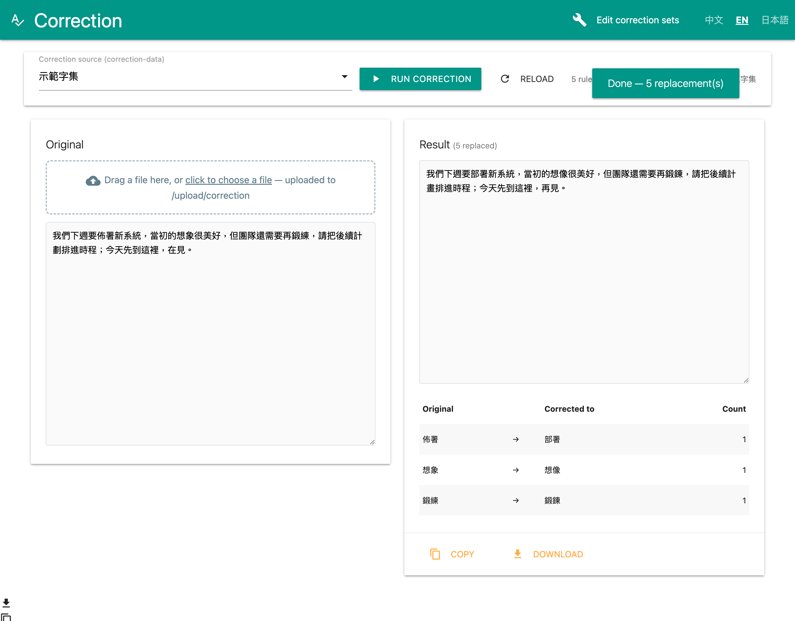

# Correction

**English** · [中文](README.zh-Hant.md) · [日本語](README.ja.md)

A WebApp for correcting the content of plain-text files (e.g. `.txt`, `.md`, `.json`, `.srt`).

**▶ Live demo:** <https://scottgfhong310.github.io/correction/> — runs entirely in your browser. The correction itself needs no server; uploading to the server folder and saving sets in the builder only work when you run it locally.

The idea comes from speech-to-text transcripts: words that were **mis-recognized because of how they sound** are batch-replaced with the correct ones, according to a "correction set".

- Backend: Node.js + Express (minimal — only static files, file upload, and saving correction sets)
- Frontend: jQuery + Materialize CSS + Lodash (all loaded from CDN)



---

## Features

Two pages:

| Page | Purpose |
| --- | --- |
| `index.html` (home) | Upload a file to correct, pick a correction set, run the correction, copy / download the result |
| `correction-data-builder.html` | Edit / add correction sets |

### `index.html` — correction flow
1. Loads `correction-data.json` (the list of correction sources).
2. **Drag** or **choose** a file to upload it to `public/upload/correction/`.
3. The left column shows the uploaded content (you can also paste text directly).
4. Pick a correction source (correction-data).
5. Click **Run correction**.
6. The right column shows the corrected result and lists the count of each replacement.
7. You can **Copy**, or **Download** with the original name plus a correction timestamp (`yyyyMMddHHmmss`).
   - If the original name already ends with a timestamp, downloading **replaces** it rather than appending a second one.
8. After editing a set in the builder, click **Reload** to apply the latest content immediately.

### `correction-data-builder.html` — edit sets
1. After the list loads, pick the correction source to edit.
2. Edit / add / delete entries, or **add a new source** (creates a new file and registers it in the list).
3. **Save** writes back to the server; before overwriting, a timestamped backup is kept under `.bak/`.

---

## Correction set format

A correction set is a `.json` array; **every string** in each entry's `source` array is replaced with `target`:

```json
[
  { "source": ["佈署", "布署"], "target": "部署" },
  { "source": ["想象"],         "target": "想像" }
]
```

`correction-data.json` is the list of sources:

```json
[
  {
    "alias": "示範字集",
    "file": "sample.json",
    "description": "示範用：常見的同音／形近錯字校正字集"
  }
]
```

> `public/correction-data/sample.json` is sample data — replace it with your own sets.

---

## UI language (i18n)

The UI supports **繁體中文 / English / 日本語**, switchable instantly from the top-right; the choice is remembered in the browser (`localStorage`). You can also force a language via a URL parameter, e.g. `?lang=ja`, `?lang=en`, `?lang=zh-Hant`.

Dictionaries are separate from the engine, all pure front-end (no dependencies, no build):

- `public/i18n.js` — the i18n engine (`t` / `apply` / `set` / `register`).
- `public/locales/<code>.js` — per-language dictionaries that self-register, e.g. `I18n.register('ja', { … }, '日本語')`.
- The language switcher is **generated automatically** from the registered languages.
- The Japanese UI loads **Noto Sans JP** (the font is only downloaded when `lang=ja`), for consistent Japanese kanji shapes across platforms.

**To add a language**, just drop a `xx.js` into `public/locales/` and include it in the pages — the engine, switcher, and page code don't change.

> Correction sets are **data content** and are never translated. Both `index.html` and `correction-data-builder.html` are trilingual.

---

## Install & run

Requires Node.js >= 16.

```bash
npm install
npm start
```

Starts on <http://localhost:3000> by default (override with an env var, e.g. `PORT=8080 npm start`).

Open <http://localhost:3000/> in a browser for the home page.

---

## Project structure

```
correction/
├─ app.js                 # Express entry: static files + upload + saving sets
├─ routes/
│  ├─ upload.js           # POST /api/upload?folder=correction
│  └─ correction.js       # GET/PUT /api/correction/... (save sets, with .bak backups)
└─ public/                # frontend (static)
   ├─ index.html
   ├─ correction-data-builder.html
   ├─ correction-lib.js   # correction engine (literal replace + stats + filename timestamp)
   ├─ correction-data.json
   ├─ correction-data/
   │  └─ sample.json
   └─ upload/correction/  # upload scratch space (contents not version-controlled)
```

---

## API

| Method | Path | Description |
| --- | --- | --- |
| `POST` | `/api/upload?folder=correction` | Upload files (multipart field `myFiles`) to `public/upload/correction/` |
| `GET`  | `/api/correction/sources` | List the `.json` sets under `correction-data/` |
| `PUT`  | `/api/correction/sources/:file` | Write back a single correction set (body is a JSON array) |
| `PUT`  | `/api/correction/list` | Write back the source list `correction-data.json` |

Writes are limited to `.json` files under `public/correction-data/`, with path-traversal protection; before overwriting, a backup is made under the sibling `.bak/`.

---

## Correction engine: `CorrectionLib`

`public/correction-lib.js` is the heart of this project — a pure front-end correction engine with **no dependencies** (only native `fetch`). Once loaded it lives on the global `window.CorrectionLib` and can be extracted on its own and applied to any page that needs "set-based replacement".

```html
<script src="correction-lib.js"></script>
<script>
  // Apply rules directly (no server needed)
  var rules = [
    { source: ["佈署", "布署"], target: "部署" },
    { source: ["想象"],         target: "想像" }
  ];
  var r = CorrectionLib.apply("儘快佈署，想象很好", rules);
  console.log(r.text);   // → "儘快部署，想像很好"
  console.log(r.total);  // → 2
  console.log(r.stats);  // → [{source:"佈署",target:"部署",count:1}, {source:"想象",target:"想像",count:1}]
</script>
```

### API

| Method | Signature | Description |
| --- | --- | --- |
| `loadList(url?)` | `(url='./correction-data.json') → Promise<Array>` | Load the source list. Adds cache-busting so you always read the latest. |
| `loadSource(file, base?)` | `(file, base='./correction-data/') → Promise<Array>` | Load a single set (`base + file`). Cache-busted too. |
| `apply(text, rules)` | `→ { text, stats, total }` | Apply corrections. See below. |
| `timestamp(date?)` | `(date=new Date()) → "yyyyMMddHHmmss"` | Produce a local timestamp. |
| `stampFilename(name, ts?)` | `(name, ts=timestamp()) → string` | Add a timestamp to a download name: if the base name already ends with one, **replace** it; otherwise **append** before the extension. |

### `apply(text, rules)`

Global replacement by **literal string** (not regex), **rule by rule in order**: every string in a rule's `source` array is replaced with that rule's `target`.

Returns:

| Field | Type | Description |
| --- | --- | --- |
| `text` | `string` | The fully corrected text |
| `stats` | `Array<{ source, target, count }>` | Each replacement that **matched**, with its count |
| `total` | `number` | Total number of replacements |

### Load a set from the server, then apply

```js
// 1) load the list → take the first set → load it → apply
const list  = await CorrectionLib.loadList();              // [{ alias, file, description }, ...]
const rules = await CorrectionLib.loadSource(list[0].file);
const out   = CorrectionLib.apply(transcript, rules);

// 2) name the download with the original name + correction timestamp
const name = CorrectionLib.stampFilename("transcript.txt");  // → "transcript-20260610153000.txt"
// transcript-20250101000000.txt → transcript-20260610153000.txt (timestamp replaced, not appended)
```

> The engine is UI-agnostic; `index.html` and `correction-data-builder.html` are just front-ends over it.

---

## License

[MIT](./LICENSE) © 2026 Scott G.F. Hong
